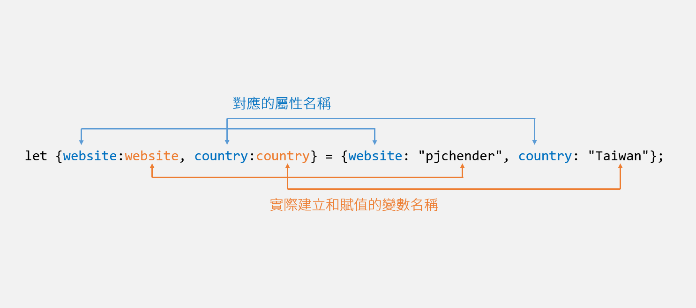

# 16-Mouse Move Shadow 個人筆記整理用

這次課程做了一個跟隨鼠標位移的陰影特效，非常的酷，感覺可以用在之後網站的 LOGO 😍

## 抓取監聽

```javascript
const hero = document.querySelector('.hero');
const text = document.querySelector('h1');
function shadow(e) {
    console.log(e);
}
hero.addEventListener('mousemove', shadow);
```
- 抓取 `hero` 跟 `h1` 的項目屬性
- 給 `hero` 掛上監聽事件

---
## 獲取座標
```javascript
const hero = document.querySelector('.hero');
const text = document.querySelector('h1');
function shadow(e) {
    const width = hero.offsetWidth;
    const height = hero.offsetHeight;
    console.log('e.wh => ',width, height)
    console.log('e.xy => ',e.offsetX, e.offsetY)

}
hero.addEventListener('mousemove', shadow);
```
- 獲取 `hero` 的 `width` 與 `height`
- `e.offsetX,e,offsetY` 為滑鼠在當前元素的座標
---
### 簡化抓取座標語法

```javascript
const hero = document.querySelector('.hero');
const text = document.querySelector('h1');
function shadow(e) {
    const { offsetWidth: width, offsetHeight: height } = hero
    let { offsetX: x, offsetY: y } = e;
    
    if (this !== e.target){
        x =  x + e.target.offsetLeft;
        y =  y + e.target.offsetTop;
    }

}
hero.addEventListener('mousemove', shadow);
```


```javascript
let obj = {
  website: "pjchender",
  country: "Taiwan"
}
let {website:wb, country:ct} = obj;
console.log(website, country);   //  Error:website in not defined
console.log(wb, ct)  // "pjchender", "Taiwan"
//---------------------------------------------
let [a, , c] = [1, 2, 3];
console.log(a, c); // 1, 3
```
- 想成對應陣列的方式，在下面 { }中的宣告則是前面是內容後面是宣告的名稱，跟一般 `var a = 1;` 相反過來。

- [ES6簡化寫法](https://pjchender.blogspot.com/2017/01/es6-object-destructuring.html)

----
## 矯正滑鼠進入子元素座標抓取不是父元素問題


滑鼠碰到 hero 時，會只計算該元素內的座標，移出元素範圍時或進入到子元素時，將計算會該元素的座標，只有移出該範圍才恢復正常。

---

DOM element 事件綁定中

this 代表的是該 Dom element

e.target 被觸發的那個 Dom element
(觸發位置在 hero 會是 hero 整個 HTM L內容 觸發在子元素 h1 時會是單獨 h1 的 HTML 內容)

---

目前的 h1 就像在 hero 中間蓋了一層布，會影響到滑鼠座標的計算。


```javascript
if (this !== e.target){
    x =  x + e.target.offsetLeft;
    y =  y + e.target.offsetTop;
}
```
- `this` => 回傳父元素( `hero` )
- `e.target` => 回傳當前碰到元件( `hero` 、 `h1` )
- 在滑入 `h1` 的範圍時 `x, y` 將會以h1做座標基準點
- 透過 `this` 一定會是hero的情況去比較目前的 `target` 
- `h1` 的 `left` 與 `top` 是對應在父元素上的座標位置
- 只要是進入 h1 的領域的話就加上他本身的 left/top，將會是繼續以父元素的座標當作計算做呈現

---

## 陰影座標
```javascript
const hero = document.querySelector('.hero');
const text = document.querySelector('h1');
const walk = 100; //100px
function shadow(e) {
    const { offsetWidth: width, offsetHeight: height } = hero
    let { offsetX: x, offsetY: y } = e;
    
    if (this !== e.target){
        x =  x + e.target.offsetLeft;
        y =  y + e.target.offsetTop;
    }
    const xWalk = Math.round((x / width * walk) - (walk / 2));
    const yWalk = Math.round((y / height * walk) - (walk / 2));

}
hero.addEventListener('mousemove', shadow);
```

- (x/width) 滑鼠 x 位移大小相對於 hero 寬度的百分比
- (y/height) 滑鼠 y 位移大小相對於 hero 高度的百分比
- 乘上 walk 得到陰影位移大小

中心點為 hero 左上角(0, 0)，想改以畫面中心為起點，因此除以2

這樣一來就取到十字座標圖，左上 (-50, -50) 右下 (50, 50)

---
## 添上陰影顏色
```javascript
const hero = document.querySelector('.hero');
const text = document.querySelector('h1');
const walk = 100; //100px
function shadow(e) {
    const { offsetWidth: width, offsetHeight: height } = hero
    let { offsetX: x, offsetY: y } = e;
    
    if (this !== e.target){
        x =  x + e.target.offsetLeft;
        y =  y + e.target.offsetTop;
    }
    const xWalk = Math.round((x / width * walk) - (walk / 2));
    const yWalk = Math.round((y / height * walk) - (walk / 2));
    text.style.textShadow = `
    ${xWalk}px ${yWalk}px 0 rgba(255,0,255,0.7),
    ${xWalk * -1}px ${yWalk}px 0 rgba(0,255,255,0.7),
    ${yWalk}px ${xWalk * -1}px 0 rgba(0,255,0,0.7),
    ${yWalk * -1}px ${xWalk}px 0 rgba(0,0,255,0.7)
    `;
}
hero.addEventListener('mousemove', shadow);
```

- 顏色上則是直接對 text.style.textShadow 進行上色